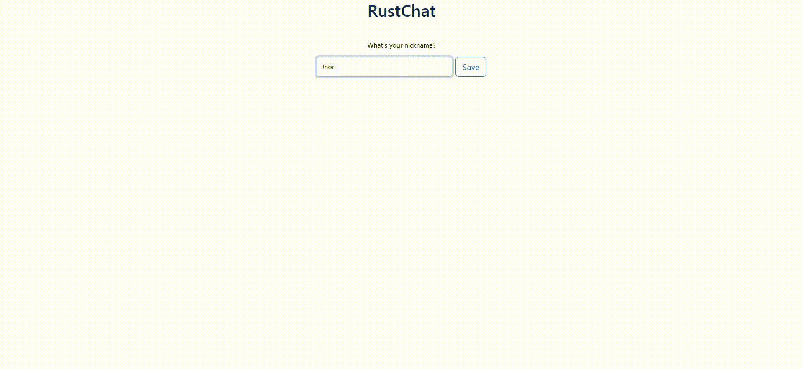

# 💬 Rust Chat
Real-time chat using [websockets](https://www.ibm.com/docs/es/was/9.0.5?topic=applications-websocket).
<p align="center">
    
</p>

## 🏗️ Technologies
Chat server has been built with the Rust languaje with [Hyper](https://hyper.rs/), [Tokio](https://tokio.rs/) and [tungstenite](https://docs.rs/tungstenite/latest/tungstenite/).

Frontend uses Solid.js and TypeScript (a faster React.js alternative).

<p align="center">
  <a href="https://skillicons.dev">
    
  </a>
</p>

## 🚀 Run project 
- First, clone this [repository](https://github.com/UO276213/RustChat.git).
```sh
cd RustChat
```

### Start server

- To start the chat server you need to have installed [Rust](https://www.rust-lang.org/es/tools/install) and then run.
  Then, you run this commands:

```sh
cargo build
cargo run
```

After this, chat server will be listening in localhost at port 3000.

### Start webpage

To start using the chat, server must be running.

```sh
cd frontend
npm install
npm run build
npm run start
```
